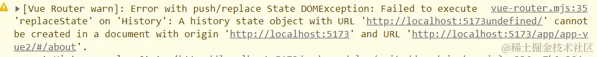

# qiankun：vue3 + vite从开发到部署实现微前端

## 背景

由于业务需要，需要在主应用中增加菜单，在页面上直接展示另外两个应用，并且要求登录信息共用，决定使用qiankun实现。

## 配置
首先准备好三个应用：
> 主应用main：vue3+vite+history路由模式
> 子应用app-vue3：vue3+vite+history路由模式
> 子应用app-vue2：vue2+webpack+hash路由模式

### 主应用main

***vite.config.ts***
```ts
import { defineConfig } from 'vite'
import vue from '@vitejs/plugin-vue'
import path from 'path'

export default defineConfig({
  base: process.env.NODE_ENV === 'production' ? '/main1/' : '/',
  plugins: [vue()],
  resolve: {
    alias: {
      '@': path.resolve(__dirname, 'src'),
    }
  },
})
```

***main.ts***
```ts
import { createApp } from 'vue'
import './style.css'
import App from './App.vue'
import router from './router'

let app = createApp(App)
router.beforeEach((to, from, next) => {
  if (!window.history.state.current) window.history.state.current = to.fullPath
  if (!window.history.state.back) window.history.state.back = from.fullPath
  // 手动修改history的state
  return next()
})
app.use(router).mount('#app')
```

安装qiankun `npm i qiankun -S`  
根目录下新建src/config.js用于存放子应用信息
```ts
export default {
  subApps: [
    {
      name: 'app-vue3', // 子应用名称，跟package.json一致
      entry: 'http://localhost:7001', // 子应用入口，本地环境下指定端口
      container: '#sub-container', // 挂载子应用的dom
      activeRule: '/app/app-vue3', // 路由匹配规则
      props: {} // 主应用与子应用通信传值
    },
    {
      name: 'app-vue2',
      entry: 'http://localhost:7002',
      container: '#sub-container',
      activeRule: '/app/app-vue2',
      props: {}
    }
  ]
}
```

根目录下新建src/utils/qiankun用于开启qiankun
```ts
import { registerMicroApps } from 'qiankun'
import config from '@/config'
const { subApps } = config
export function registerApps() {
  try {
    registerMicroApps(subApps, {
      beforeLoad: [
        app => {
          console.log('before load', app)
        }
      ],
      beforeMount: [
        app => {
          console.log('before mount', app)
        }
      ],
      afterUnmount: [
        app => {
          console.log('before unmount', app)
        }
      ]
    })
  } catch (err) {
    console.log(err)
  }
}
```

新建一个组件，用于加载子应用src/components/SubContainer.vue
```html
<template>
  <div id="sub-container"></div>
</template>
<script>
import { start } from 'qiankun'
import { registerApps } from '@/utils/qiankun'
export default {
  mounted() {
    if (!window.qiankunStarted) {
      window.qiankunStarted = true
      registerApps()
      start({
        sandbox: {
          experimentalStyleIsolation: true // 样式隔离
        }
      })
    }
  }
}
</script>
```

配置一下路由src/router/routes
```ts
const routes = [
  {
    path: '',
    redirect: { name: 'home' },
    meta: { title: '首页' },
    children: [
      {
        path: '/home',
        name: 'home',
        component: () => import('../views/home/index.vue')
      },
      {
        // history模式需要通配所有路由，详见vue-router文档
        path: '/app/app-vue3/:pathMatch(.*)*',
        name: 'app-vue3',
        meta: {},
        component: () => import('@/components/SubContainer.vue')
      },
      {
        path: '/app/app-vue2/',
        name: 'app-vue2',
        meta: {},
        component: () => import('@/components/SubContainer.vue')
      }
    ]
  }
]
export default routes
```

最后在首页src/App.vue放置`<router-view />`
```html
<template>
  <div>
    <a href="https://vitejs.dev" target="_blank">
      
    </a>
    <a href="https://vuejs.org/" target="_blank">
      
    </a>
  </div>
  <router-link to="/app/app-vue2/#/">vue-app2</router-link>
  &nbsp;
  <router-link to="/app/app-vue3">vue-app3</router-link>
  <router-view />
</template>
<style lang="scss" scoped>
.logo {
  height: 6em;
  padding: 1.5em;
  will-change: filter;
  transition: filter 300ms;
}
.logo:hover {
  filter: drop-shadow(0 0 2em #646cffaa);
}
.logo.vue:hover {
  filter: drop-shadow(0 0 2em #42b883aa);
}
</style>
```

### 子应用vue-app3

安装`vite-plugin-qiankun`  `npm i vite-plugin-qiankun --save-dev`

修改 `vite.config.ts`
```ts
import { defineConfig } from 'vite'
import vue from '@vitejs/plugin-vue'
import qiankun from 'vite-plugin-qiankun'
export default defineConfig({
  plugins: [
    vue(),
    qiankun('app-vue3', {
      useDevMode: true
    })
  ],
  server: {
    port: 7001,
    headers: {
      'Access-Control-Allow-Origin': '*'
    }
  }
})
```

由于路由模式为history，需要匹配子应用的入口规则，修改src/router/index
```ts
import {  createRouter,  createWebHistory } from 'vue-router'
import routes from './routes'
import { qiankunWindow } from 'vite-plugin-qiankun/dist/helper'
const router = createRouter({
  history: createWebHistory(
    qiankunWindow.__POWERED_BY_QIANKUN__
      ? '/app/app-vue3/'
      : '/'
  ),
  routes
})
export default router
```

在main.ts里添加生命周期
```ts
import { createApp } from 'vue'
import App from './App.vue'
import router from './router'
import {  renderWithQiankun,  qiankunWindow } from 'vite-plugin-qiankun/dist/helper'

let app

const render = (container) => {
  app = createApp(App)
  app
    .use(router)
    .mount(container ? container.querySelector('#app') : '#app')
}

const initQianKun = () => {
  renderWithQiankun({
    mount(props) {
      const { container } = props
      render(container)
    },
    bootstrap() {},
    unmount() {
      app.unmount()
    }
  })
}
qiankunWindow.__POWERED_BY_QIANKUN__ ? initQianKun() : render()
```
单独运行，指定7001端口; 微前端环境运行; 比较主页home

### 子应用vue-app2

创建src/public-path
```ts
if (window.__POWERED_BY_QIANKUN__) {
    // eslint-disable-next-line no-undef
    __webpack_public_path__ = window.__INJECTED_PUBLIC_PATH_BY_QIANKUN__
}
```

main.js修改
```ts
import Vue from 'vue'
import App from './App.vue'
import router from './router'
import store from './store'
import './public-path'

Vue.config.productionTip = false

let instance = null

function render(props = {}) {
  const { container } = props
  instance = new Vue({
    router,
    store,
    render: h => h(App)
  }).$mount(container ? container.querySelector('#app') : '#app')
}

if (!window.__POWERED_BY_QIANKUN__) {
  render();
}

export async function bootstrap() {
  console.log('[vue] vue app bootstraped')
}
export async function mount(props) {
  console.log('[vue] props from main framework', props);
  render(props)
}
export async function unmount() {
  instance.$destroy()
  instance.$el.innerHTML = ''
  instance = null
}
```

vue.config.js修改

```ts 
const { name } = require('./package')
module.exports = {
  devServer: {
    port: 7002,
    headers: {
      'Access-Control-Allow-Origin': '*',
    },
  },
  configureWebpack: {
    output: {
      library: `${name}-[name]`,
      libraryTarget: 'umd', // 把微应用打包成 umd 库格式
      jsonpFunction: `webpackJsonp_${name}`,
    },
  },
}
```
分别单独运行，指定7002端口,微前端环境运行

#### 踩坑点：
子应用切换时出现以下警告：

解决方案：
主应用增加：
```ts
router.beforeEach((to, from, next) => {
  if (!window.history.state.current) window.history.state.current = to.fullPath
  if (!window.history.state.back) window.history.state.back = from.fullPath
  // 手动修改history的state
  return next()
})
```

## 部署相关

1. 修改子应用配置的entry

修改为部署到服务器上的index.html的入口,
若把子应用部署到服务器根目录下的app-vue3文件夹，则修改为：
```ts
{
  name: 'app-vue3', // 子应用名称，跟package.json一致
  entry: process.env.NODE_ENV === 'development'
    ? '//localhost:7001'
    : '/app-vue3/index.html', // 子应用入口，本地环境下指定端口
  container: '#sub-container', // 挂载子应用的dom
  activeRule: '/app/app-vue3', // 路由匹配规则
  props: {} // 主应用与子应用通信传值
}
```

2. 修改子应用配置的activeRule(取决于主应用在服务器上部署的路径)

由于主应用是history路由模式，activeRule需要完全匹配（hash模式只需匹配hash路由中#号开始部分）
如：
```ts
{
  name: 'app-vue3', // 子应用名称，跟package.json一致
  entry: process.env.NODE_ENV === 'development'
    ? '//localhost:7001'
    : '/app-vue3/index.html', // 子应用入口，本地环境下指定端口
  container: '#sub-container', // 挂载子应用的dom
  activeRule: process.env.NODE_ENV === 'development'
    ? '/app/app-vue3'
    : '/main/app/app-vue3', // 路由匹配规则
  props: {} // 主应用与子应用通信传值
}
```

3. 修改子应用vite/webpack/vue-cli静态资源路径的配置（详细可在文末源码查看）

vite应用：
```ts
import { defineConfig } from 'vite'
import vue from '@vitejs/plugin-vue'
import qiankun from 'vite-plugin-qiankun'

export default defineConfig({
  base: process.env.NODE_ENV === 'production' ? '/app-vue3/' : '/',
  plugins: [
    vue(),
    qiankun('app-vue3', {
      useDevMode: true
    })
  ],
  server: {
    port: 7001,
    headers: {
      'Access-Control-Allow-Origin': '*'
    }
  }
})
```

微前端：**增量升级，独立运行，技术栈无关，独立开发、独立部署**

动态加载、隔离
**Single-spa/qiankun/MicroApp**

koca-template基座，koca-micro
main: resisterMicroapps / actions.getGlobalState() / .setGlobalState() 
common: commonStore.globalResister(store,props)
sub:renderMicroApp(props), unmountMicroApp(props)
```json
// micro.main.json
{
  "MICRO_APPS": [
    {
      "name": "admin-basic",
      "entries": {
        "dev": "http://localhost:7001/admin-basic/",
        "prod": "http://localhost:7001/admin-basic/"
      },
      "container": "#admin-basic-container",
      "prefixPath": "#/admin-basic"
    },
    {
      "name": "test",
      "entries": {
        "dev": "http://localhost:7002/examples/composition/test/aehyok.html",
        "prod": "http://localhost:7002/examples/composition/test/aehyok.html"
      },
      "container": "#test",
      "prefixPath": "#/test"
    }
  ]
}
```

## 对微前端的理解

微前端的核心理念是将前端应用程序看作是一个整体，由多个独立的部分组成。每个部分被视为一个微前端应用，它们可以具有自己的技术栈、开发流程和团队组织。这种方式使得团队可以独立开发和部署各个子应用，减少了协调和合并的复杂性。

## 为什么 Iframe 无法胜任微前端的工作？

IFrame 在传统的前端开发中是一种常见的技术，用于在页面中嵌入其他网页或应用程序。然而，在微前端架构中，IFrame 并不是一个理想的选择，主要是因为以下几个方面的限制：  
1. 隔离性和通信复杂性：IFrame 本身提供了一种隔离的环境，但这也带来了通信和数据交互的复杂性。由于每个子应用都在独立的 IFrames 中运行，它们之间的通信需要通过特定的机制，如消息传递，而这增加了开发和维护的复杂性。
2. 性能和加载时间：每个 IFrames 都需要加载和渲染独立的 HTML、CSS 和 JavaScript。这意味着在加载微前端应用时，需要同时加载多个 IFrames，导致额外的网络请求和页面资源占用，可能会影响性能和加载时间。
3. 样式和布局限制：IFrame 的内容在页面中是独立的，它们具有自己的 CSS 样式和布局上下文。这导致在微前端架构中难以实现全局样式的一致性，以及子应用之间的布局和交互的协调问题。
4. 浏览器安全性限制：由于安全策略的限制，IFrame 之间的跨域通信可能受到限制，特别是在涉及跨域资源访问和共享数据时。这可能导致在微前端架构中需要处理复杂的安全性问题。
鉴于以上限制，微前端架构通常采用其他技术手段来实现子应用的拆分和集成，例如使用 Web Components、JavaScript 模块加载器等。这些技术能够提供更好的隔离性、通信机制和性能优化，使得微前端架构更具可行性和灵活性。
